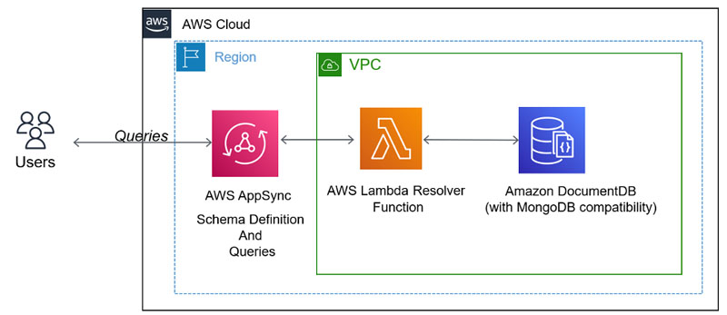
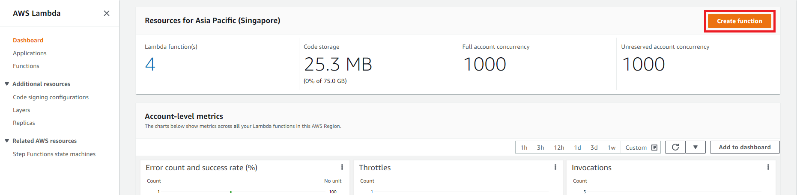
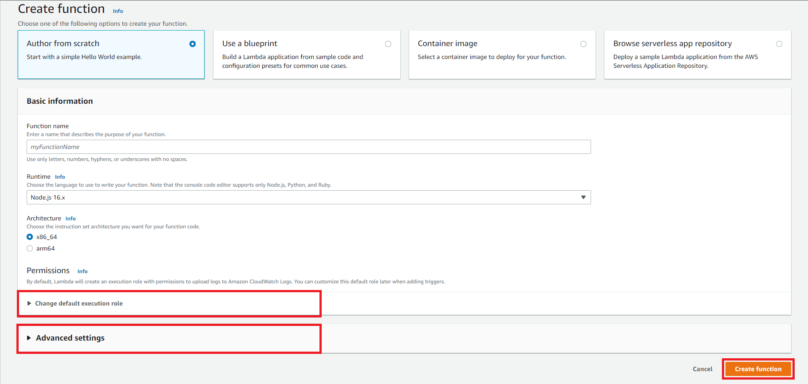
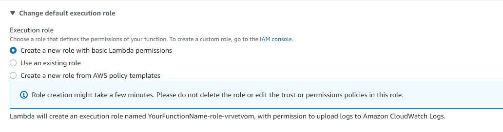
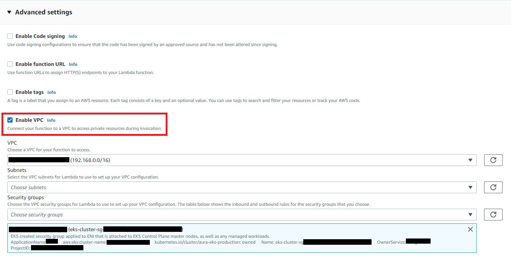
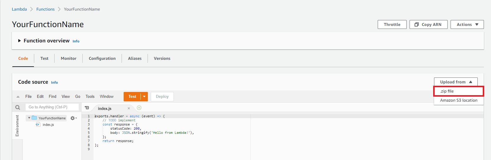

# Horoscope GraphQL
This repository defines AWS Lambda Function to be used as a Resolver for AWS AppSync (HoroscopeGraphQL - GraphQL API Service). HoroscopeGraphQL provides queries to Horoscope's DocumentDB, which is used to store data of several Cosmos-based Networks (including Aura Network).

## How it works
We create a GraphQL schema and provision a Lambda function that enables us to connect to Amazon DocumentDB as a data source. We can then run AWS AppSync queries to retrieve data from Horoscope's Amazon DocumentDB.

## Deployment guide
### I. Create Lambda Function
The whole repository is being zipped and uploaded to Lambda Function's Code source.

#### 1. Access AWS Lambda Service and click on `Create function`.

#### 2. In the create function step, choose `Author from scratch` and configure some information for your function.

- **Change default execution role:** you need to have a role with basic Lambda permissions.
 
- **Enable VPC:** you have to connect your function with Horoscope's DocumentDB by adding Lambda Function to the same VPC as the DocumentDB.

After the configuration step is finished, click on `Create function`.

#### 3. Wait until your function is created, then choose upload from .zip file and upload this project's zip file

### II. Set up AWS AppSync
Follow the AWS guideline [here](https://aws.amazon.com/blogs/database/build-a-graphql-api-for-amazon-documentdb-with-mongodb-compatibility-using-aws-appsync/) to set up AWS AppSync Service (Start from the step `Set up AWS AppSync`).

After setting up AWS AppSync Service and providing the Lambda Function as its Resolvers, your service is good to go.