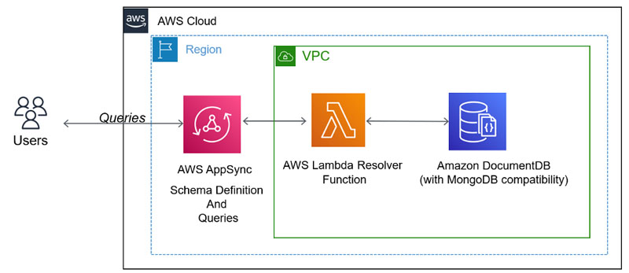

# Horoscope GraphQL
This repository defines AWS Lambda Function to be used as a Resolver for AWS AppSync (HoroscopeGraphQL - GraphQL API Service). HoroscopeGraphQL provides queries to Horoscope's DocumentDB, which is used to store data of several Cosmos-based Networks (including Aura Network).

## How it works
We create a GraphQL schema and provision a Lambda function that enables us to connect to Amazon DocumentDB as a data source. We can then run AWS AppSync queries to retrieve data from Horoscope's Amazon DocumentDB.

## Data provided

**Information about request parameters and response data can be found [here](./docs/schema.json).**

### 1. Account Auth
Auth queries the auth information of an account.
### 2. Account Balances
AllBalances queries the balance of all coins for a single account.
### 3. Account Spendable Balances
SpendableBalances queries the spenable balance of all coins for a single account.
### 4. Account Delegations
DelegatorDelegations queries all delegations of a given delegator address.
### 5. Account Redelegations
Redelegations queries redelegations of given address.
### 6. Account Unbonds
DelegatorUnbondingDelegations queries all unbonding delegations of a given delegator address.
### 7. Block
Block queries block data based on given requirements.
### 8. Code Id
Code Id queries code ids exist on network.
### 9. Community Pool
CommunityPool queries the community pool coins.
### 10. CW20 Asset
CW20Asset queries tokens based on given requirements.
### 11. CW721 Asset
CW721Asset queries NFTs based on given requirements.
### 12. Inflation
Inflation queries the inflation.
### 13. Param
Params queries the all type of params.
### 14. Pool
Pool queries the pool info.
### 15. Proposal
Proposals queries all proposals based on given requirements.
### 16. Supply
TotalSupply queries the total supply of all coins.
### 17. Transacion
Transaction queries tx data based on given requirements.
### 18. Validator
Validator queries all validators based on given requirements.

## Deployment guide
### 1. Create Lambda Function
The whole repository is being zipped and uploaded to Lambda Function's Code source.
### 2. Set up AWS AppSync
Follow the AWS guideline [here](https://aws.amazon.com/blogs/database/build-a-graphql-api-for-amazon-documentdb-with-mongodb-compatibility-using-aws-appsync/) to set up AWS AppSync Service (Start from the step `Set up AWS AppSync`).

After setting up AWS AppSync Service and providing the Lambda Function as its Resolvers, your service is good to go.