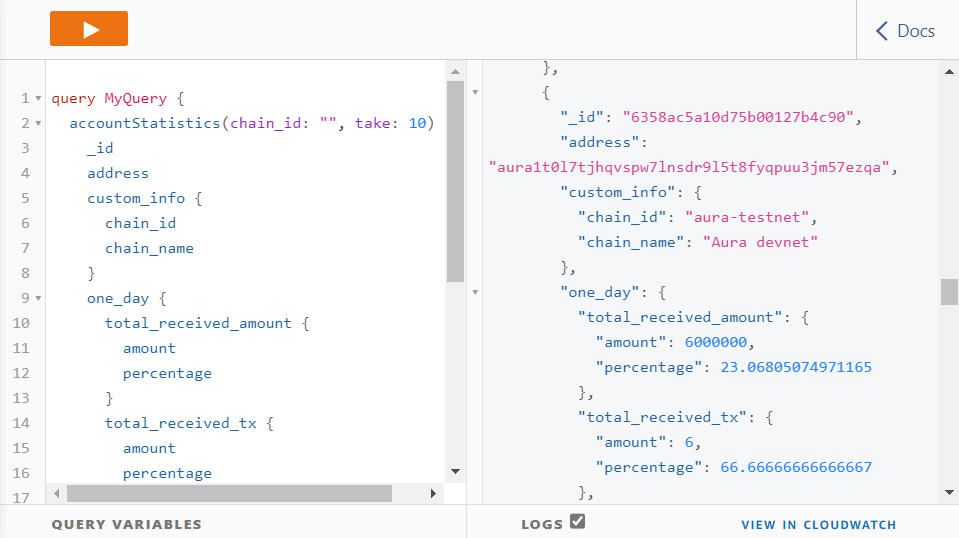

# How to use HoroscopeGraphQL using AppSync
In order to use AWS AppSync, you will need to be provided with an IAM user to sign in to AWS Console.

## I. How to use AppSync Queries

### 1. Sign in
After signing in to AWS Console with your account, head to the Search bar and search for AWS AppSync.

### 2. Choose APIs
At AWS AppSync page, from APIs, choose your APIs.

### 3. Queries
At your APIs page, redirect to Queries, here is where all the GraphQL data is shown.

## II. Example

### 1. Daily Blockchain Data
The Daily Blockchain Data is stored inside table daily_tx_statistics hourly (UTC +0).
The date param in the query follow the pattern `YYYY-MM-DDThh:mm:ss.fffZ`

#### a. Query Example

#### b. Response Example

### 2. Top Accounts By Day
The Top Account Stats is stored inside table account_statistics and stored based on account's address following with account's stat from last day, last three days or last seven days.

#### a. Query Example

#### b. Response Example

> By default, if you do not define the chain_id param in the query, it will return data from Aura Devnet.